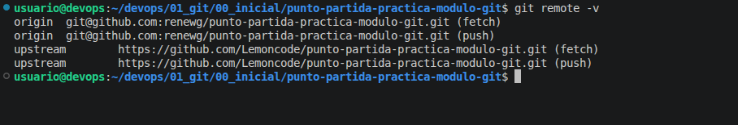
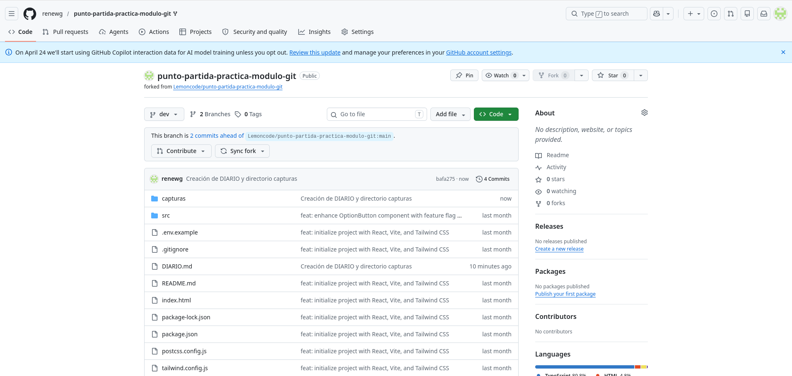
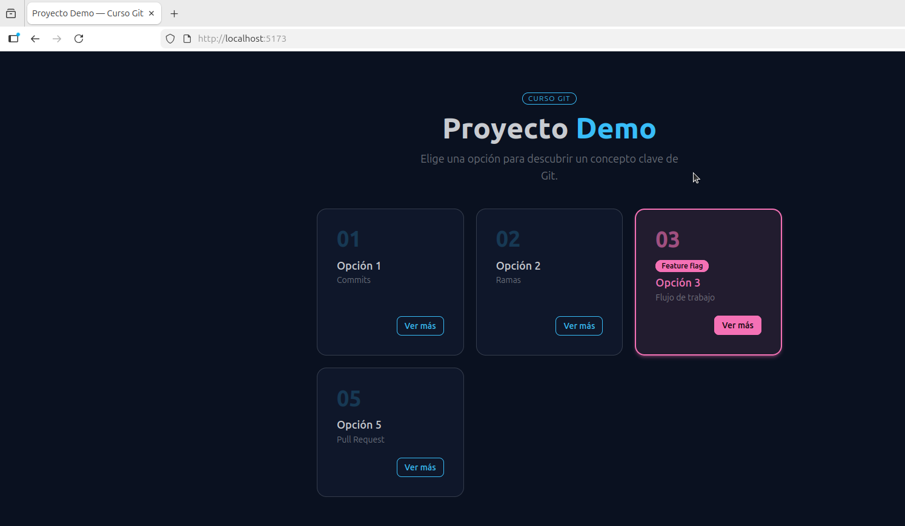
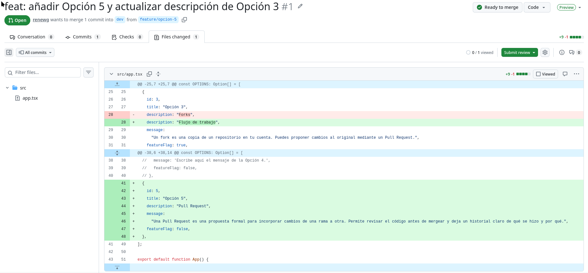

# Tarea 1
Tras haber hecho un fork de la rama de trabajo y haberlo descargado, he configurado el upstream así como la rama dev y he creado el directorio capturas y el fichero DIARIO.md. Luego he hecho un commit seguido de un push para subirlo a mi rama.

Un fork es una copia completa de un repositorio en otro dentro de GitHub y manteniendo una conexión con el repositorio original.

Se denomina upstream al repositorio remoto original del que se sacó la copia.

# Tarea 2
Se ha añadido una nueva rama (feature/opcion-5) a partir de la rama **dev** en la que se ha añadido una 5 opción y actualizada la 3ª opción, modificando el fichero src/app.tsx.
Se trabaja desde la rama **dev** para que en todo momento tengamos la rama **main** disponible por si fuera necesario realizar alguna modificación en ella sin que esté afectada por las modificaciones de desarrollo.

# Tarea 3
Se ha añadido una nueva rama (feature/opcion-6) a partir de la rama **dev** en la que se ha añadido una 6ª opción así como se ha actualizado loa 3ª opción. Esto se ha hecho modificando el fichero src/app.tsx.
Un **conflicto** en git es cuando dos ramas distintas que parten de la misma base y modificando la misma línea de un mismo fichero tratan de trasladar sus cambios a la rama original. El conflicto surge al no saber qué modificación de las que han hecho simultáneamente es la que debe permanecer.

# Tarea 4
Se ha hecho un Pull Request de la rama feature/opcion-5 hacia **dev** revisando los cambios introducidos.

